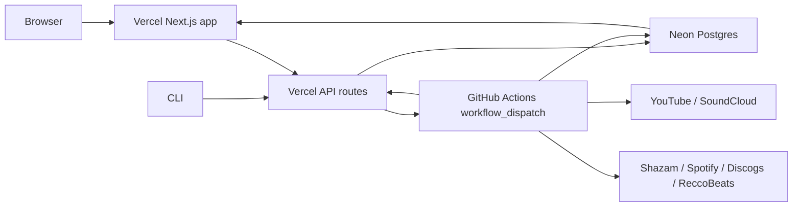

# Plan: DJ Set Setlist Generator on `GitHub Actions + Vercel (frontend + API) + Neon`

## Summary
This plan defines a Vercel-first architecture where the web app and API/control plane live entirely inside a Next.js app on Vercel, the database lives in Neon, and long-running ingestion/recognition compute runs in GitHub Actions.

The chosen implementation profile is:
- Monorepo
- Vercel hosts both frontend and backend API
- Neon is used as serverless Postgres only, not as the auth/backend platform
- Auth uses `Auth.js + Google`
- Data access uses `Drizzle ORM + SQL migrations`
- GitHub Actions repo remains public for maximum free hosted-runner minutes
- Public users can browse published data
- Only allowlisted signed-in users can submit/rerun/cancel jobs
- CLI uses personal API tokens, not browser auth
- Spotify playlists are created in the submitting user’s Spotify account
- Neon uses `prod + dev` branches only, not per-preview branching
- `stream-direct` is the primary worker architecture
- `download-first/local-file` remains fallback and local-debug mode

## Coverage Audit For Critical Design Decisions
This plan explicitly covers the five areas that were strongest in the Supabase-oriented version and that must remain intact in the Vercel/Neon version:

1. **Auth and allowlist**
   - Covered by `Auth.js + Google`, `authn.user_profiles`, and an explicit authorization matrix.
   - Browsing is public.
   - Job submission and Spotify connection are restricted to allowlisted users.

2. **Per-user Spotify token handling**
   - Covered by `authn.spotify_connections` plus internal access-token exchange endpoints.
   - Refresh tokens are encrypted at rest in Neon.
   - GitHub Actions never receives refresh tokens directly.

3. **CLI auth and remote submission shape**
   - Covered by `authn.api_tokens`, token mint/revoke routes, and the explicit remote CLI contract.
   - CLI and browser submit through the same job API and see the same job model.

4. **Queueing, retry, cancel, and stale-run recovery**
   - Covered by `ops.submissions`, `ops.set_runs`, `ops.set_run_leases`, SQL claim/recovery functions, and the scheduler workflow.
   - This plan now defines the state machines and ownership rules explicitly.

5. **Schema separation between published data and operational state**
   - Covered by the `authn`, `app`, and `ops` schemas.
   - Public pages read only from `app`.
   - Runtime orchestration and recovery operate only on `ops`.

## Architecture


## Platform Responsibilities
### Vercel
- Hosts the Next.js frontend.
- Hosts all public and operator API routes.
- Handles Auth.js session management.
- Dispatches GitHub workflows.
- Mints and validates CLI API tokens.
- Stores no durable source-of-truth state outside Neon.
- Exposes internal endpoints for workers:
  - scheduler
  - dispatch-next
  - Spotify access-token exchange
  - cache revalidation

### Neon
- Stores all published app data.
- Stores all operational job state.
- Stores Auth.js tables.
- Stores hashed CLI tokens.
- Stores encrypted Spotify refresh tokens.
- Is accessed only from Vercel and GitHub workers, never directly from the browser.

### GitHub Actions
- Runs artist discovery workflows.
- Runs per-set processing workflows.
- Runs the `2-slot` recognition matrix.
- Runs a scheduled recovery/dispatch workflow.
- Writes status and final records back to Neon.
- Calls internal Vercel API endpoints for orchestration handoff and revalidation.

## Why This Variant Exists
This variant is appropriate if the priority is:
- keeping the product backend in the same Vercel app as the frontend
- avoiding a second backend platform such as Supabase Edge Functions/Auth
- using Neon as a cleaner “database-shaped” product
- using the Vercel + Next.js ecosystem you already know

The tradeoff versus the Supabase variant is:
- more backend code you own
- more auth/control-plane work in the Next.js app
- less built-in backend ergonomics
- no Supabase RLS/direct-browser model

## Repo Layout
Use this monorepo structure:

```text
/apps/web
  app/
  components/
  lib/
  auth/
  db/
  api/
  styles/

/worker
  cli.py
  config.py
  db.py
  jobs/
  pipeline/
  providers/

/drizzle
  migrations/
  schema/

/.github/workflows
  process-set.yml
  discover-artist.yml
  scheduler.yml

/docs
  architecture/
  operations/
```

## Implementation Stack
### Web app
- Next.js App Router
- TypeScript
- Node.js runtime for all API routes
- `pnpm` workspace
- `Auth.js` for Google login
- `Drizzle ORM`
- `@neondatabase/serverless` for Vercel-side DB access
- `zod` for request validation
- `swr` or lightweight polling for operator status pages

### Worker
- Python 3.11+
- keep current Python modules, refactored into `/worker`
- `psycopg` for direct Neon access
- `yt-dlp`
- `ffmpeg`
- `shazamio`
- `spotipy`
- current recognition, set-building, and enrichment logic reused where practical

### Migrations
- Drizzle schema and SQL migrations are the single source of truth
- app code uses Drizzle
- worker code uses direct SQL against the same schema
- atomic lease-claiming and stale-recovery logic lives in SQL functions

## Environment Model
### Neon branch strategy
Use one Neon project with two branches:
- `main` = production
- `dev` = development + Vercel preview + local dev

Do not use automatic preview branches in v1.

Rationale:
- you explicitly chose `prod + dev only`
- Neon’s own Vercel docs say manual connection is the right choice when you want custom CI/CD control, which you do because GitHub Actions is part of orchestration
- this keeps deployment predictable

### Environment wiring
- Vercel Production environment uses Neon `main` pooled connection URL
- Vercel Preview environment uses Neon `dev` pooled connection URL
- Vercel Development environment uses Neon `dev` pooled connection URL
- GitHub Actions production workflows use Neon `main`
- GitHub Actions dev/manual test workflows can use Neon `dev`

## Public Interfaces

### Web routes
Implement these UI routes:
- `/`
- `/sets`
- `/sets/[slug]`
- `/artists`
- `/artists/[slug]`
- `/dashboard`
- `/dashboard/jobs`
- `/dashboard/jobs/[submissionId]`
- `/dashboard/submit`
- `/dashboard/settings`
- `/dashboard/tokens`

### Auth routes
Implement Auth.js routes:
- `/api/auth/[...nextauth]`
- custom sign-in page at `/signin`

### API routes
Implement these Vercel API routes in the Next.js app:

- `POST /api/jobs`
- `GET /api/jobs/:submissionId`
- `POST /api/jobs/:submissionId/retry`
- `POST /api/jobs/:submissionId/cancel`
- `POST /api/tokens`
- `DELETE /api/tokens/:tokenId`
- `GET /api/spotify/start`
- `GET /api/spotify/callback`
- `POST /api/internal/dispatch-pending`
- `POST /api/internal/scheduler`
- `POST /api/internal/spotify-token`
- `POST /api/internal/revalidate`

All internal routes must require `x-internal-secret`.

### CLI contract
Preserve the current positional UX, but make remote execution the default:

- `python -m worker.cli "https://..."` submits a single set
- `python -m worker.cli "Artist Name"` submits artist discovery
- `python -m worker.cli --artist "Artist" --sets "url1" "url2"` submits curated artist mode
- `python -m worker.cli --status <submission_id>`
- `python -m worker.cli --wait ...`
- `python -m worker.cli --local ...` keeps the current laptop-style flow
- `python -m worker.cli auth login --token <plain_api_token>` stores a personal CLI token locally
- `python -m worker.cli auth logout` removes it

CLI auth source order:
1. `DJSET_API_TOKEN` env var
2. local token file in user config dir
3. explicit `--token`

## Auth Model
### Web auth
Use `Auth.js + Google`.
- Auth.js handles browser sessions.
- Session strategy is database-backed via Drizzle adapter.
- User identity lives in Neon in Auth.js tables.

### Allowlist
Only allowlisted users can submit jobs or connect Spotify.
Store allowlist state in a separate app table, not as custom columns on Auth.js tables.

### CLI auth
Use personal API tokens.
- Tokens are minted from the dashboard.
- Plain token is shown once.
- Only a salted hash is stored in Neon.
- Route handlers authenticate CLI calls with `Authorization: Bearer <token>`.

This avoids trying to reuse browser cookies/Auth.js sessions in CLI flows.

### Authorization matrix
Use this authorization model consistently across UI, API routes, and internal endpoints:

| Actor | Can browse public data | Can view own jobs | Can submit jobs | Can retry/cancel own jobs | Can retry/cancel any job | Can connect Spotify | Can mint CLI tokens | Can manage allowlist |
|---|---|---|---|---|---|---|---|---|
| Anonymous user | Yes | No | No | No | No | No | No | No |
| Signed-in, not allowlisted | Yes | No | No | No | No | No | No | No |
| Allowlisted operator | Yes | Yes | Yes | Yes | No | Yes | Yes | No |
| Admin | Yes | Yes | Yes | Yes | Yes | Yes | Yes | Yes |
| GitHub worker via internal secret | No | No | No | No | No | No | No | No |

Additional rules:
- Every `ops.submissions` row has a `requested_by` owner.
- Every `ops.set_runs` row inherits the same owner unless created by an admin acting on behalf of another user in a future extension.
- CLI API tokens inherit the permissions of their owning user and never bypass allowlist checks.
- Internal worker endpoints authenticate only via `x-internal-secret` and do not rely on session cookies or API tokens.

### Per-user Spotify token lifecycle
Implement Spotify token handling as follows:

1. Allowlisted signed-in user clicks `Connect Spotify`.
2. `GET /api/spotify/start` generates the authorization URL with the user session embedded in the `state` value.
3. `GET /api/spotify/callback` exchanges the code for Spotify tokens.
4. Store only the refresh token long-term in `authn.spotify_connections`.
5. Encrypt the refresh token using an app-level symmetric key from `TOKEN_ENCRYPTION_KEY`.
6. Store these fields:
   - `user_id`
   - `spotify_user_id`
   - `refresh_token_ciphertext`
   - `scopes`
   - `connected_at`
   - `updated_at`
   - `last_refresh_at`
   - `last_error`
   - `revoked_at`
7. When a run needs playlist creation, the GitHub worker calls `POST /api/internal/spotify-token` with `setRunId`.
8. The Vercel API:
   - verifies the run owner
   - decrypts the refresh token
   - exchanges it for a fresh access token
   - returns only the short-lived access token and `spotify_user_id`
9. The worker creates playlists using that short-lived token only.
10. If the token refresh fails:
   - the set run does **not** fail the whole pipeline
   - playlist creation is marked as skipped with an operator-visible warning
   - `ops.worker_events` records the failure reason

Disconnect semantics:
- Disconnecting Spotify sets `revoked_at` and clears `refresh_token_ciphertext`.
- Existing completed playlists are unaffected.
- Future runs with `createPlaylist=true` are allowed to complete, but playlist creation is skipped with warning until the user reconnects.

## Database Design
Use three logical schemas:
- `authn` for Auth.js and user-auth-related tables
- `app` for published site data
- `ops` for processing state

### `authn` schema
| Table | Purpose |
|---|---|
| `authn.users` | Auth.js users |
| `authn.accounts` | Auth.js OAuth accounts |
| `authn.sessions` | Auth.js sessions |
| `authn.verification_tokens` | Auth.js verification tokens |
| `authn.user_profiles` | app-owned profile fields; `user_id`, `email`, `display_name`, `is_allowlisted`, `is_admin` |
| `authn.api_tokens` | CLI tokens; `id`, `user_id`, `name`, `token_hash`, `last_used_at`, `revoked_at`, timestamps |
| `authn.spotify_connections` | encrypted Spotify refresh token per user; `user_id`, `spotify_user_id`, `refresh_token_ciphertext`, `scopes`, timestamps |

### `app` schema
| Table | Purpose |
|---|---|
| `app.artists` | canonical artist entities |
| `app.tracks` | canonical track entities |
| `app.track_artists` | track-to-artist relationships |
| `app.sets` | published set entities |
| `app.set_artists` | set-to-artist relationships |
| `app.set_entries` | final ordered timeline entries for each set |

Required columns match the Supabase-variant plan conceptually:
- slugs
- normalized names/titles
- source platform/source URL/source ID
- duration/uploader/image
- external IDs and URLs
- metadata JSONB
- timestamps

### `ops` schema
| Table | Purpose |
|---|---|
| `ops.submissions` | top-level submission objects |
| `ops.set_runs` | one row per concrete set being processed |
| `ops.set_run_leases` | coarse recognition work units |
| `ops.segment_hits` | raw recognition hits per segment |
| `ops.discovery_candidates` | audit trail for discovered URLs |
| `ops.worker_events` | structured worker logs |

Schema boundary rules:
- `authn` is the only place for user identity, sessions, API tokens, and Spotify credentials.
- `app` is the only place the public site reads from.
- `ops` is the only place for queue state, recovery state, and worker logs.
- No public page or anonymous route is allowed to query `ops` directly.
- Operator job pages may read `ops` through authenticated API routes only.

Operational retention defaults:
- keep `ops.segment_hits` for `7 days`
- keep `ops.worker_events` for `14 days`
- keep `ops.discovery_candidates` for `7 days`
- keep `ops.submissions` and `ops.set_runs` indefinitely unless a later archival policy is added
- implement cleanup in `scheduler.yml`, not as a separate platform dependency

### SQL helper functions
Create these PostgreSQL functions:
- `ops.claim_next_lease(set_run_id uuid, worker_name text)`
- `ops.complete_lease(lease_id uuid, success boolean, error_text text default null)`
- `ops.recover_stale_leases(stale_before interval)`
- `ops.recover_stale_set_runs(stale_before interval)`
- `ops.dispatchable_set_runs(max_active integer)`
- `ops.mark_run_stage(...)`

Use these functions from both Vercel API and Python workers.

## Data Access Strategy
### Vercel app
- Use Drizzle + `@neondatabase/serverless`
- Public pages query Neon from server components only
- Operator actions go through Route Handlers
- No browser-direct database access
- No RLS-dependent design

### GitHub workers
- Use `psycopg` with Neon pooled connection string
- Use raw SQL for lease operations and operational writes
- Use shared SQL function contracts, not ORM inside Python

### Caching strategy
- Public pages are server-rendered with tag-based caching
- Cache tags:
  - `sets`
  - `artists`
  - `set:<slug>`
  - `artist:<slug>`
- Publish step triggers `POST /api/internal/revalidate`
- Operator job pages are uncached and poll every 5 seconds only while open

## API Design

### `POST /api/jobs`
Auth:
- web session or CLI API token
- user must be allowlisted

Accepted payloads:
- `{ mode: "single_set", sourceUrl, createPlaylist }`
- `{ mode: "artist_discovery", artistName, createPlaylist, maxSetsOverride? }`
- `{ mode: "curated_artist", artistName, sourceUrls, createPlaylist }`

Behavior:
1. validate input with `zod`
2. create `ops.submissions`
3. for single-set and curated mode, create `ops.set_runs`
4. for artist-discovery mode, only create submission row
5. immediately call local dispatch service logic
6. return `submissionId`, `status`

Ownership and response rules:
- `requested_by` is always derived from the authenticated user, never from request body input.
- `createPlaylist` is accepted only for allowlisted users and is automatically forced to `false` if the user has no active Spotify connection.
- If `createPlaylist=true` but no Spotify connection exists, return `202 Accepted` with a warning payload rather than rejecting the submission.

### `GET /api/jobs/:submissionId`
Auth:
- owner, allowlisted operator, or admin
- CLI API token also valid

Returns:
- submission row
- child set-runs
- current stage/status
- failure summaries
- published set slugs when complete

### CLI submission and polling contract
The CLI must call the same Vercel API routes as the web app.

Required behavior:
- `python -m worker.cli auth login --token <plain_api_token>`
  - stores token at `platformdirs.user_config_dir("dj-set-setlist")/credentials.json`
- `python -m worker.cli auth logout`
  - deletes the stored credentials file
- `python -m worker.cli "https://..." --wait`
  - submits `POST /api/jobs`
  - polls `GET /api/jobs/:submissionId`
  - prints stage transitions until terminal state
- `python -m worker.cli --status <submission_id>`
  - reads `GET /api/jobs/:submissionId`
- `python -m worker.cli --local`
  - bypasses remote submission and runs the existing local pipeline only

Exit codes:
- `0` completed successfully
- `1` failed or cancelled
- `2` partial success

Polling defaults:
- every `5s` for active runs
- timeout is opt-in only; the CLI otherwise waits indefinitely with Ctrl+C interrupt support

### `POST /api/jobs/:submissionId/retry`
Behavior:
- owner or admin only
- reset failed run state
- redispatch if capacity available

### `POST /api/jobs/:submissionId/cancel`
Behavior:
- owner or admin only
- mark `cancel_requested`
- workers observe cancellation between leases

### `POST /api/tokens`
Behavior:
- allowlisted signed-in user only
- create new API token
- store hash only
- return plain token once

### `DELETE /api/tokens/:tokenId`
Behavior:
- revoke token
- token immediately unusable

### `GET /api/spotify/start`
Behavior:
- signed-in allowlisted user only
- starts Spotify OAuth flow

### `GET /api/spotify/callback`
Behavior:
- exchanges code
- encrypts and stores refresh token in `authn.spotify_connections`

### `POST /api/internal/dispatch-pending`
Behavior:
- internal only
- dispatches next eligible queued work to GitHub
- enforces global concurrency

### `POST /api/internal/scheduler`
Behavior:
- internal only
- recover stale leases
- recover stale set-runs
- dispatch queued work if capacity is free

### `POST /api/internal/spotify-token`
Behavior:
- internal only
- given `setRunId`, fetch the run owner’s encrypted Spotify refresh token
- exchange it for an access token
- return short-lived token and Spotify user ID
- never send refresh token to GitHub

### `POST /api/internal/revalidate`
Behavior:
- internal only
- invalidates relevant cache tags after publish

## Submission, Run, and Lease State Machines

### Submission state machine
`ops.submissions.status` allowed transitions:

- `queued -> discovering`
- `queued -> running`
- `discovering -> running`
- `running -> completed`
- `running -> partial`
- `running -> failed`
- `queued|discovering|running -> cancelled`
- `failed|partial -> queued` on retry

Rules:
- `artist_discovery` starts in `queued`, then moves to `discovering`.
- once one or more `set_runs` exist, the submission moves to `running`.
- `completed` means all child set-runs completed successfully.
- `partial` means at least one child run completed and at least one failed or cancelled.
- `failed` means no child run completed successfully.

### Set-run state machine
`ops.set_runs.status` allowed transitions:

- `queued -> dispatched`
- `dispatched -> resolving`
- `resolving -> recognizing`
- `recognizing -> aggregating`
- `aggregating -> enriching`
- `enriching -> publishing`
- `publishing -> completed`
- any active state -> `failed`
- `queued|dispatched|resolving|recognizing -> cancelled`
- `failed|cancelled -> queued` on retry

Rules:
- `attempt_count` increments each time a set-run is redispatched from `queued` to `dispatched`.
- `published_set_id` is set only during `publishing`.
- playlist creation warnings do not downgrade `completed` to `partial`; they are non-fatal warnings.

### Lease state machine
`ops.set_run_leases.status` allowed transitions:

- `pending -> claimed`
- `claimed -> completed`
- `claimed -> failed`
- `claimed -> pending` on stale recovery
- `failed -> pending` on run retry

Rules:
- a lease is stale if `claimed_at` is older than `30 minutes` and the owning GitHub job has not updated run heartbeat fields
- stale recovery returns the lease to `pending` and clears `claimed_by`
- the scheduler is the only component allowed to stale-recover claimed leases

### Stale-run recovery policy
Implement these scheduler rules:

1. Run every `15 minutes`.
2. For any claimed lease older than `30 minutes`, move it back to `pending`.
3. For any `set_run` stuck in `dispatched`, `resolving`, or `recognizing` with no heartbeat for `60 minutes`:
   - mark active leases stale
   - set run back to `queued`
   - preserve `attempt_count`
   - append a `worker_events` row explaining the recovery
4. For any submission in `running` whose child runs are all terminal:
   - recalculate submission status to `completed`, `partial`, `failed`, or `cancelled`
5. Dispatch next eligible queued work only after recovery completes

### Retry policy
- Default retry target is only failed or cancelled child `set_runs`.
- `ops.segment_hits` for failed leases are kept until the retried run overwrites or supersedes them.
- Retry clears:
  - `error_summary`
  - `published_set_id`
  - lease statuses for the target run
- Retry does not delete prior `worker_events`; it appends a new retry event instead.

## Queue and Concurrency Policy
Launch defaults:
- maximum active `set_run` count: `1`
- recognition slots per active set-run: `2`
- no extra Shazam parallelism inside each slot
- each slot processes leases serially
- lease size: `10` segments
- segment duration: `30s`
- segment overlap: `15s`
- Shazam cooldown duration: `60s`

This preserves your empirically safe Shazam behavior while still decomposing the pipeline.

Dispatch policy:
- `POST /api/internal/dispatch-pending` is the single dispatcher.
- It selects from `ops.dispatchable_set_runs(max_active=1)`.
- Ordering is FIFO by `created_at`, then `id`.
- Only one dispatcher call may dispatch work at a time; enforce this with a DB advisory lock or a serialized transaction around selection/update.
- `discover-artist.yml`, `process-set.yml finalize`, and `scheduler.yml` all call the same dispatcher endpoint instead of embedding separate dispatch logic.

## GitHub Actions Workflows

### `discover-artist.yml`
Inputs:
- `submission_id`
- `environment`

Jobs:
1. `bootstrap`
2. `discover`
3. `create-set-runs`
4. `dispatch-next`

Behavior:
- load submission from Neon
- run artist discovery
- persist all candidates
- filter accepted candidate URLs
- create `ops.set_runs`
- ask Vercel to dispatch the next queued set-run

### `process-set.yml`
Inputs:
- `submission_id`
- `set_run_id`
- `environment`

Jobs:
1. `bootstrap`
2. `recognize`
3. `aggregate`
4. `enrich`
5. `publish`
6. `finalize`

### `bootstrap`
Behavior:
- load set_run
- fetch title/duration/platform/source metadata
- compute total segment count
- create leases
- set status to `recognizing`

### `recognize`
Matrix:
- `slot: [0, 1]`
- `max-parallel: 2`

Each worker loop:
1. claim next lease from Neon
2. resolve fresh stream URL from original source URL
3. process all segments in that lease serially
4. FFmpeg-seek each slice into a temp file
5. call Shazam
6. write `ops.segment_hits`
7. delete temp file immediately
8. on stream expiry, refresh URL once and retry current segment
9. on rate-limit cooldown, sleep and continue
10. mark lease complete or failed

Important default:
- do not share direct media URLs across jobs
- each slot resolves its own stream URL

### `aggregate`
Behavior:
- wait for both matrix jobs to complete
- rebuild recognitions from `ops.segment_hits`
- run existing setlist aggregation logic
- dedupe overlaps and unknown gaps
- build the final normalized timeline in memory

### `enrich`
Behavior:
- run Spotify/Discogs/ReccoBeats enrichment
- if playlist creation requested:
  - call internal Vercel token endpoint
  - create playlist in submitting user’s Spotify account
- do not persist new temp files beyond process lifetime

### `publish`
Behavior:
- upsert canonical artists/tracks
- upsert set row and set entries
- attach `published_set_id` to set_run
- call `/api/internal/revalidate`

### `finalize`
Behavior:
- mark set_run and submission states
- record errors if any
- call `/api/internal/dispatch-pending` to start the next queued run

### `scheduler.yml`
Trigger:
- `schedule` every 15 minutes
- `workflow_dispatch`

Behavior:
- call `/api/internal/scheduler`
- recover stale work
- dispatch queued work
- no dependency on Vercel Cron

Use GitHub Actions for scheduler because Vercel Hobby cron is limited to once per day.

## Worker Refactor Plan
Refactor the current Python code into these modules:

- `worker/cli.py`
- `worker/config.py`
- `worker/db.py`
- `worker/jobs/discover_artist.py`
- `worker/jobs/process_set.py`
- `worker/pipeline/recognize.py`
- `worker/pipeline/aggregate.py`
- `worker/pipeline/enrich.py`
- `worker/providers/ytdlp.py`
- `worker/providers/shazam.py`
- `worker/providers/spotify.py`
- `worker/providers/discogs.py`

Required code changes:
- keep current local CLI behavior behind `--local`
- replace file checkpointing for remote mode with DB checkpointing in `ops.*`
- remove product-facing JSON/Markdown/HTML writes from remote runs
- keep current formatter/output code only for:
  - local mode
  - migration/import tooling
  - optional export endpoints later
- preserve current setlist builder and enrichment logic where practical
- switch remote recognition orchestration from local semaphore concurrency to matrix-slot concurrency

## Vercel App Design

### Public pages
- Home page with recent sets and featured artists
- Sets index with filtering/sorting
- Set detail page that reproduces the existing explorer behavior in React:
  - embedded YouTube/SoundCloud player
  - timeline markers
  - deeplink jump buttons
  - confidence labels
  - metadata links
- Artists index
- Artist detail pages with profile metadata and associated sets

### Operator pages
- Sign-in page
- Dashboard summary
- Submit page with three submission modes
- Jobs list
- Submission detail view
- Settings page for:
  - allowlist status
  - Spotify connection
  - API token management

### Runtime decisions
- all route handlers use `runtime = "nodejs"`
- do not use Edge runtime for control-plane routes
- public pages use server components for DB reads
- client-side polling only where interactivity is needed

## Account and Credential Setup

### GitHub
1. Make the repo public.
2. Enable Actions.
3. Add repo secrets:
   - `NEON_DATABASE_URL_PROD`
   - `NEON_DATABASE_URL_DEV`
   - `APP_BASE_URL_PROD`
   - `APP_BASE_URL_DEV`
   - `INTERNAL_WORKER_SHARED_SECRET`
   - `SPOTIFY_CLIENT_ID`
   - `SPOTIFY_CLIENT_SECRET`
   - `DISCOGS_TOKEN`
   - `NTFY_TOPIC` optional
4. Use public hosted runners.
5. Keep workflow permissions minimal.

### Vercel
1. Create a Vercel project for `apps/web`.
2. Add environment variables:
   - `AUTH_SECRET`
   - `AUTH_GOOGLE_ID`
   - `AUTH_GOOGLE_SECRET`
   - `APP_BASE_URL`
   - `DATABASE_URL`
   - `DATABASE_URL_MIGRATIONS`
   - `GITHUB_DISPATCH_TOKEN`
   - `GITHUB_OWNER`
   - `GITHUB_REPO`
   - `GITHUB_WORKFLOW_PROCESS_SET`
   - `GITHUB_WORKFLOW_DISCOVER_ARTIST`
   - `INTERNAL_WORKER_SHARED_SECRET`
   - `TOKEN_ENCRYPTION_KEY`
   - `SPOTIFY_CLIENT_ID`
   - `SPOTIFY_CLIENT_SECRET`
   - `SPOTIFY_REDIRECT_URI`
3. Production env uses Neon `main`.
4. Preview and Development envs use Neon `dev`.

### Neon
1. Create a Neon account and project.
2. Use manual connection, not automatic preview branching integration.
3. Create branches:
   - `main`
   - `dev`
4. Copy pooled connection URLs for both branches.
5. Create roles:
   - `app_runtime`
   - `worker_runtime`
   - `migrator`
6. Grant least-privilege access:
   - `app_runtime` to `authn`, `app`, `ops`
   - `worker_runtime` to `app` and `ops`, plus only required reads from `authn.spotify_connections` via controlled API instead of direct DB if preferred
   - `migrator` full schema migration rights
7. Use `main` for production, `dev` for local and preview.

### Google Cloud
1. Create OAuth web app.
2. Authorized redirect URI:
   - `https://<your-vercel-domain>/api/auth/callback/google`
3. Put client ID and secret in Vercel env vars.

### Spotify Developer Dashboard
1. Create Spotify app.
2. Redirect URI:
   - `https://<your-vercel-domain>/api/spotify/callback`
3. Reuse same app for metadata client credentials and per-user playlist OAuth.

### Discogs
1. Create a personal token.
2. Store it in GitHub Actions secrets.

## Relevant Free-Tier Limits

### GitHub Actions
Relevant current official constraints:
- hosted job max runtime: `6 hours`
- matrix max: `256 jobs/workflow`
- public repo hosted-runner use is the favorable free path for this design

Workload translation:
- one-hour set at your launch settings is about `35` wall minutes with 2 slots
- total runner time per set is about `70 runner-minutes`
- public repo keeps this viable on free
- if the repo becomes private on GitHub Free later, `2,000` minutes/month would only cover about `28` such sets/month

### Vercel Hobby
Current official Hobby figures relevant to this design:
- `1,000,000` function invocations
- `4 CPU-hours`
- `360 GB-hours` provisioned memory
- `100 GB-hours` function duration
- usage is shared across projects in the same Vercel account/team

Workload translation for this architecture:
- Vercel is only handling auth, submission, status, token minting, and lightweight internal callbacks
- even at `44 sets/month`, if each submission produces about `100` status polls and `10` other API hits, that is only about `4,840` invocations/month
- that is comfortably below the `1,000,000` invocation limit
- because route handlers should stay short and lightweight, Vercel CPU/memory usage should be minor
- your other Vercel projects still share the account-level pool, but this app’s API usage should remain modest if public pages are cached

Important Vercel constraint:
- Hobby cron is only once per day, so do not use Vercel Cron for orchestration or recovery

### Neon Free
Current official Neon Free limits relevant to this design:
- `100 projects`
- `10 branches/project`
- `100 CU-hours/month per project`
- `0.5 GB storage/project`
- scale to zero after `5 minutes` idle
- `5 GB` included public network egress
- `60K` Neon Auth MAUs, though this plan does not use Neon Auth directly

Workload translation:
- `0.5 GB` storage still supports roughly `1,500` to `3,000` normalized sets at your expected data density
- the database workload here is intermittent metadata reads/writes, not sustained compute
- with scale-to-zero and cached public pages, Neon compute is unlikely to be the launch bottleneck
- the main DB risk is not CU-hours; it is accidentally forcing too many uncached SSR queries or overly aggressive dashboard polling

## Deployment and Migration Strategy
### Branch/environment policy
- develop schema and app changes against Neon `dev`
- Vercel preview/development deployments use `dev`
- production deploys use Neon `main`
- promote changes by applying committed migration files to `main`
- do not rely on Neon branch copy/promotion for schema rollout

### Implementation order
1. Restructure repo into monorepo.
2. Add Next.js app in `apps/web`.
3. Add Drizzle config and initial schema files.
4. Stand up Neon project with `main` and `dev`.
5. Implement Auth.js + Google.
6. Implement allowlist and CLI token tables and routes.
7. Implement app and ops schema plus SQL helper functions.
8. Implement Vercel route handlers for jobs and internal endpoints.
9. Refactor worker into `/worker`.
10. Implement `discover-artist.yml`.
11. Implement `process-set.yml`.
12. Implement `scheduler.yml`.
13. Implement public set and artist pages.
14. Implement operator dashboard and submit flows.
15. Implement Spotify connect flow.
16. Add import script for existing JSON outputs.
17. Run dev end-to-end tests on Neon `dev`.
18. Apply migrations to `main`.
19. Deploy production Vercel app.
20. Run production smoke tests.

## Testing and Acceptance Criteria

### Unit tests
- Auth.js session helpers
- allowlist checks
- API token hashing and verification
- Spotify token encryption/decryption
- lease-claim SQL functions
- stream URL refresh retry logic
- set aggregation still matches local behavior

### Integration tests
- Google sign-in creates user and profile rows
- allowlisted user can submit jobs
- non-allowlisted user cannot submit jobs
- CLI bearer token can submit and query status
- artist discovery creates set_run rows
- process-set workflow completes and publishes rows
- retry and cancel routes work
- internal scheduler recovers stale leases
- internal revalidate invalidates cache tags after publish

### End-to-end scenarios
- single YouTube set submitted from dashboard completes and appears publicly
- single SoundCloud set submitted from dashboard completes and appears publicly
- curated artist submission with multiple URLs completes sequentially
- artist discovery submission creates multiple set_runs and drains queue correctly
- CLI remote submission works with API token
- per-user Spotify playlist creation succeeds for a connected operator account
- local fallback mode still works on laptop

### Launch success criteria
- public users can browse published data without login
- allowlisted operators can submit all three job modes
- dashboard accurately shows job progression
- GitHub Actions workers update Neon in real time enough for polling UI
- published pages are cacheable and refresh after publish
- no durable application state depends on flat files

## Explicit Assumptions and Defaults
- The same product behavior from the current CLI remains in scope.
- Remote mode becomes the default; local mode remains available.
- Auth uses `Auth.js + Google`, not Neon Auth.
- CLI uses personal API tokens.
- Vercel owns all frontend and API responsibilities.
- Neon is used as serverless Postgres only.
- Drizzle is the only ORM in the TypeScript app.
- Python workers use raw SQL, not a Python ORM.
- One active set-run at a time is the launch default.
- Two recognition workers per set-run is the launch default.
- Stream-direct is the primary path.
- Full download is fallback/local-debug only.
- Vercel preview deployments and local development share the Neon `dev` branch.
- GitHub Actions scheduler runs every 15 minutes.
- Spotify playlists are created in the submitting user’s Spotify account.
- Discogs uses personal token auth only.
- ReccoBeats remains as currently wired unless implementation confirms a missing key/config need.

## Important Public API / Type Additions
- New route handlers for jobs, tokens, Spotify connect, and internal orchestration
- New CLI auth flow using personal API tokens
- New DB schemas: `authn`, `app`, `ops`
- New operational types:
  - `Submission`
  - `SetRun`
  - `SetRunLease`
  - `SegmentHit`
  - `ApiToken`
  - `SpotifyConnection`
- New internal orchestration contract between GitHub Actions and Vercel:
  - dispatch
  - scheduler
  - token exchange
  - revalidate

## Reference Links
- [Neon pricing](https://neon.com/pricing)
- [Neon + Vercel overview](https://neon.com/docs/guides/vercel-overview)
- [Auth.js](https://authjs.dev/)
- [GitHub Actions limits](https://docs.github.com/en/actions/reference/limits)
- [Vercel functions limits](https://vercel.com/docs/functions/limitations)
- [Vercel Hobby plan](https://vercel.com/docs/plans/hobby)
- [Vercel usage docs](https://vercel.com/docs/platform/usage/)
- [Vercel cron usage/pricing](https://vercel.com/docs/cron-jobs/usage-and-pricing)
